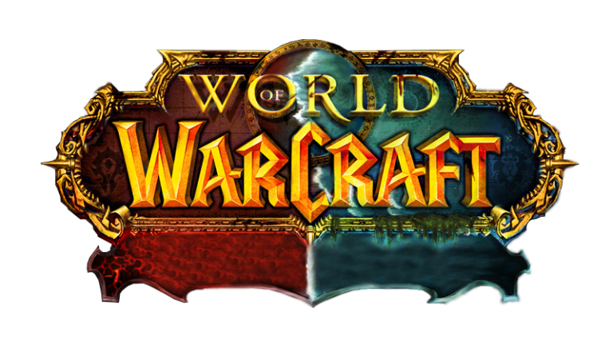

<p align="center">
    
</p>
<h3 align="center">Trade Chat - Warcraft</h3>
<p align="center">
    Real-time Chat Client, branded in the wacraft universe · ⚒️ Vue.js, Firebase
    <br />
    <a href="https://wow-chat-88f4c.web.app/">View Demo</a>
</p>

## Start Adventure

```
git clone
npm install
npm run dev
```


### Patch 1.0
### Savoux - Shaman Prograncement - Level 23

## Quests

 - [ ] Reduce image size to a maximum of 450kb.
Reward: 5 gold, [Necklace of Speed]: - 50% load time

- [ ] Add responsive styling with at a breakpoint of 786px width.
Reward: 20 gold, [Helmet of Vision]: + 300% increase in user base

-  [ ] Add a whisper sound on receiving a message
Reward: 2 gold, [Noggenfoger Elixir]: + 5% intellect

- [ ] There are two files which share the same functionality in template, style and logic, abstract them to share the functionality and work with props.
Reward: 10 gold, [Insigna of the Horde]: On use, removes tech debt from your inventory

- [ ] Map username to color of faction in the chat panel.
Reward: 5 gold, [Horde Tabard]

  

## Spellbook
**Hex** - 5 mana - Shrink images with the power of online compressors
**Raise A PR** - 20 mana - To complete a quest, raise a pull request from a separate branch. And don't ever push directly to master, or your party will wipe.
**Farsight** - 10 mana - Trigger Chrome Responsive mode to inspect breakpoints
**Composition** - 50 mana - When cast, abstracts similar functionalities from files, reducing their count and improving code reusability

### Blizzard Patch News:

**Patch 1.1**
A new quest is in the works! Starting with patch 3.2 Azeroth heroes will be able to speak in their native languages,

as well as in Common.
